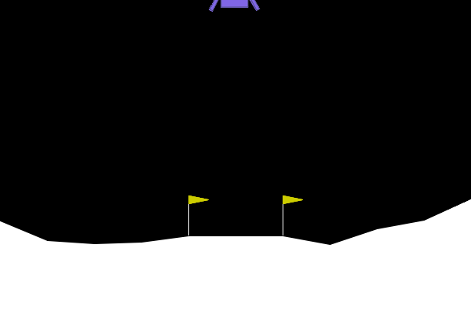
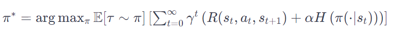

## Soft Actor Critic

Untrained             |  Trained Actor
:-------------------------:|:-------------------------:
  |  

This repository contains an implementation of Soft Actor Critic [(SAC)](https://arxiv.org/pdf/1801.01290) which is an off-policy reinforcement learning algorithm designed for continuous action spaces. It introduces a soft value function and utilizes an entropy regularization term to encourage exploration. SAC aims to optimize both the policy and the value function simultaneously, providing stability and efficient learning in complex environments with high-dimensional state and action spaces.

In entropy-regularized reinforcement learning, the agent gets a bonus reward at each time step proportional to the entropy of the policy at that timestep. Mathematically this renders the RL problem to:

which is explained in more detail in this [derivation](https://spinningup.openai.com/en/latest/algorithms/sac.html).

In `sac.ipynb` SAC is implemented and well explained. It is then used to safely land a lunarlander from [Gymnasium environments](https://gymnasium.farama.org/environments/box2d/lunar_lander/).
